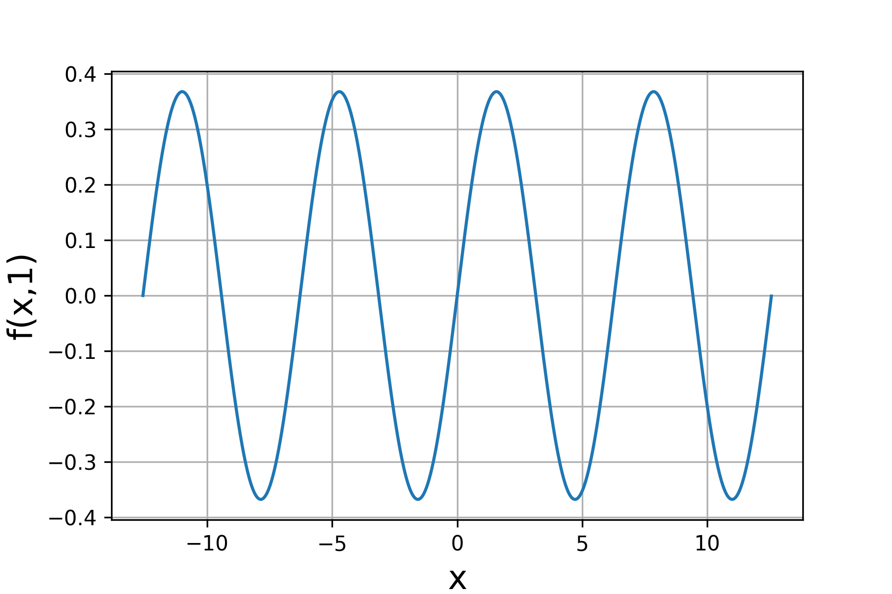
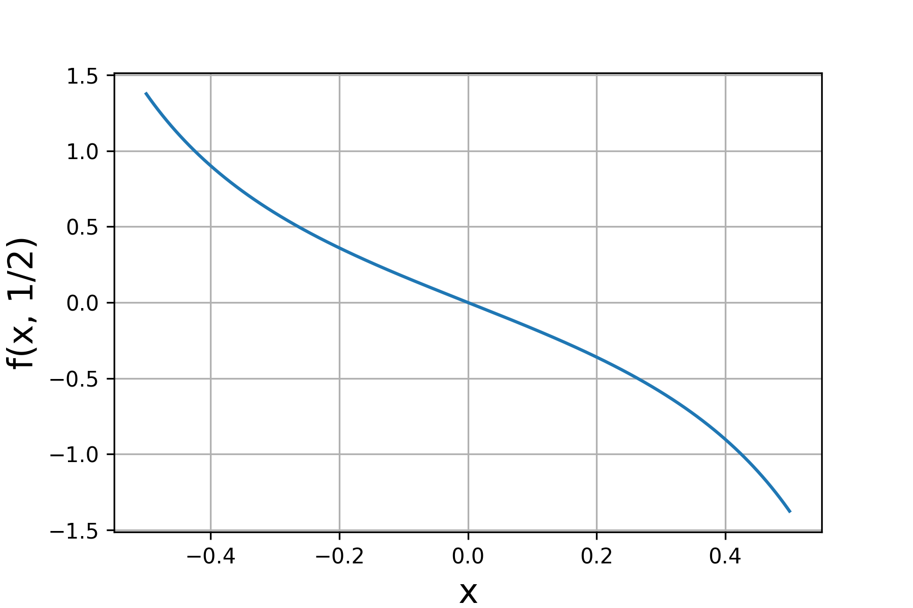
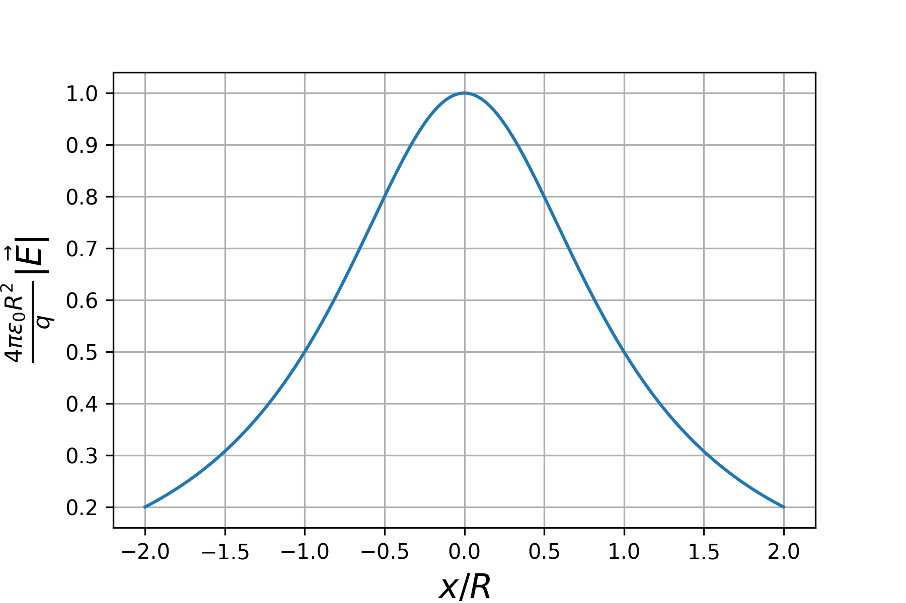

# Part 1
> Consider the function 
> $$f(x,y) = e^{-y}\sin(x)$$
> Plot $$f(x, 1)$$ vs. $$x$$ for $$x$$ in the interval $$(-4\pi, 4\pi)$$

The key is to first define a python function which represents $$f(x,y)$$. We will need pythons numerical library and plotting library, so we import `numpy` and `matplotlib.pyplot`

~~~
import numpy as np
import matplotlib.pyplot as plt
~~~
{: .language-python}

Since we imported numpy "as" `np` and matplotlib.pyplot "as" plt, `np.____` represents a function from the library of numpy. We will need to use the sine and exponential functions from numpy. First we define a python function that is $$f(x,y)$$.

~~~
def func(x,y):
    return np.exp(-y)*np.sin(x)
~~~
{: .language-python}

Recall that numpy is quite versatile; the function arguments `x` and `y` need not be floats: they can also be numpy arrays. In particular

* If both $$x$$ and $$y$$ are numbers, the return of `func` will also be a number
* If one of $$x$$ and $$y$$ is a number and the other is a numpy array, then the return will be an array
* If both $$x$$ and $$y$$ are numpy arrays, then they **must** be the same size and the return will be an array.

Now we define an array of values from $$-4\pi$$ to $$4\pi$$. The easiest way to do this is to use `np.linspace` or `np.arange`. They work slightly differently:

~~~
# Option 1
x = np.linspace(-4*np.pi, 4*np.pi, 1000)
# Option 2
x = np.arange(-4*np.pi, 4*np.pi, 0.01)
~~~
{: .language-python}

The first option creates an array of 1000 equally spaced $$x$$ points from $$-4\pi$$ to $$4\pi$$. The second option creates $$x$$ points with a spacing of $$0.01$$ to go from $$-4\pi$$ to $$4\pi$$.  Now we can plug in the array to our numpy function.

~~~
f = func(x,1)
~~~
{: .language-python}

Now we will plot $$f(x,1)$$ vs. $$x$$ using `matplotlib.pyplot`. Since we imported this as `plt`, all the matplotlib functions will be `plt.___`. Below we create plot and add the $$x$$ and $$y$$ labels. Finally, we use `plt.show()` so the plot shows up in jupyter notebook.

~~~
plt.plot(x, f) # Create a canvas and plot the data
plt.xlabel('x', fontsize=16) # Add an x-label and specify the font size
plt.ylabel('f(x,1)', fontsize=16) 
plt.grid()
plt.show() # Show the plot in the jupyter notebook
~~~
{: .language-python}

{:width="50%"}

> ## Your turn
> Consider the function  $$f(x,y) = e^{-y}\sin(x)$$ Plot  $$f(\pi/2, y)$$ vs. $$y$$ for $$y$$ in the interval $$(-3, 3)$$
{: .challenge}

# Part 2
> Consider the function 
> $$f(x,y) = \int_{0}^{2 \pi} \frac{\sin(\theta) \cdot (x-\cos(\theta))}{((x-\cos(\theta))^2+(y-\sin(\theta))^2)^{3/2}} d\theta $$
> 1. Write a program to find $$f(x,y)$$ for arbitrary values of $$x$$ and $$y$$
> 2. Find $$f(1,1)$$.
> 3. Plot $$f(x,1/2)$$ vs. $$x$$ for $$x$$ in the interval $$(-2, 2)$$

Now our function is a little more complicated: we need to solve an integral to obtain our function. Lucky for us, python has plenty of numerical integration techniques embedded in numpy: **no need to solve integrals!** Lets slowly go through the proper method to solve integrals in python.

First we define an integrand function.

~~~
def my_integrand(theta, x, y):
    return (np.sin(theta)*(x-np.cos(theta)))/((x-np.cos(theta))**2+(y-np.sin(theta))**2)**(3/2) 
~~~
{: .language-python}

Note that the variable we want to integrate over **comes first in the arguments** (in this case $$\theta$$), followed by addition arguments $$x$$ and $$y$$. Next we use the scipy.integrate function **quad** to perform an integral. We import it here and then use it:

~~~
from scipy.integrate import quad
quad(my_integrand, 0, 2*np.pi, args=(1,1))
~~~
{: .language-python}

The first argument to quad is the integrand function. Then we specify the lower and upper bounds of the integral. Finally, the parameter `args` specifies any addition values to pass to the integrand function. In this case we are specifying the values $$x=1$$ and $$y=1$$. The number of points in args depends on how many parameters the integrand function takes. If, for example, the integrand was defined as `my_integrand(theta, x, y, z)`, then args would need to take in three points to specify the values of $$x$$, $$y$$, and $$z$$.

Now lets talk about what is returned by the quad function; two values are returned. The first is the value of the integral and the second is and estimate of the absolute error of the result. In this case, we only care about the first argument, but in scientific research it is often important to keep track of errors as well.

Now that we know how to integrate, we can define our function from the beginning of the problem. Note the `[0]` at the end of the quad(...) function; this means we are taking only the first return value (and not the error):

~~~
def func(x,y):
    return quad(my_integrand, 0, 2*np.pi, args=(x,y))[0]
~~~
{: .language-python}

Now we can solve the integral for arbitrary $$x$$ and $$y$$:

~~~
func(1,1)
~~~
{: .language-python}

We can evaluate the integral for many different $$x$$ values. Note that we now need to use `np.vectorize(func)` as opposed to just `func`. This is because `func` passes `x` to the `quad` function but the parameters passed to `args` can **only be floats** in this case. This is a problem since `x` is an array, but using `np.vectorize` fixes this by essentially creating a forloop.

~~~
x = np.linspace(-1/2, 1/2, 1000)
f = np.vectorize(func)(x, 0.5)
~~~
{: .language-python}

Now lets plot $$f(x,1/2)$$ for $$x$$ in the range (-1/2,1/2)

~~~
plt.plot(x,f)
plt.xlabel('x', fontsize=16)
plt.ylabel('f(x, 1/2)', fontsize=16)
plt.grid()
plt.show()
~~~
{: .language-python}

{:width="50%"}

> ## Your turn
> Consider now the different function
> $$f(x,y) = \int_{0}^{2 \pi} \frac{\sin(\theta) \cdot (y-\sin(\theta))}{((x-\cos(\theta))^2+(y-\sin(\theta))^2)^{3/2}} d\theta $$
>
> Plot $$f(1/2,y)$$ vs. $$y$$ for $$y$$ in the interval $$(-2, 2)$$
{: .challenge}

# Part 3
> Consider the formula for the magnitude of the electric field from a point charge at the origin:
> $$|\vec{E}| = \frac{1}{4 \pi \epsilon_0} \frac{q}{r^2} $$
> Plot the magnitude of the electric field as a function of $$x$$ in the range $$(-2R, 2R)$$ when $$y=R$$ and $$z=0$$.

The main purpose of this question is for you to realize that there are undefined variables ($$q$$, $$R$$) and we are asked to plot the electric field without knowing what their values are. Noting that

$$|\vec{E}| = \frac{1}{4 \pi \epsilon_0} \frac{q}{x^2+y^2} = \frac{1}{4 \pi \epsilon_0 R^2} \frac{q}{(x/R)^2+(y/R)^2} $$

it *is possible* to plot

$$\frac{4 \pi \epsilon_0 R^2}{q} |\vec{E}| = \frac{1}{(x/R)^2 + (y/R)^2}$$

for $$(x/R)$$ in the range $$(-2, 2)$$ when $$y/R=1$$ instead. Note that this form of the equation is identical to the form of the final equation in part 3 of the tutorial.  Even though the question says *plot the magnitude of the electric field* (which is technically $$ \lvert \vec{E} \rvert $$), this cannot be done numerically, so you'll have to plot $$4 \pi \epsilon_0 R^2 \lvert \vec{E} \rvert /q$$ the instead.

~~~
def func(x_R, y_R):
    return 1/(x_R**2+y_R**2)
~~~
{: .language-python}

Now we use numpy to evaluate our function at all the given $$x$$ values. Since our array is actually of values $$x/R$$ and not $$x$$, I like to name the variable $$x_R$$.

~~~
x_R = np.linspace(-2, 2, 1000)
f = func(x_R, 1)
~~~
{: .language-python}

Finally, we plot

~~~
plt.plot(x_R, f)
plt.xlabel('$x/R$', fontsize=16)
plt.ylabel(r'$\frac{4 \pi \epsilon_0 R^2}{q}|\vec{E}|$', fontsize=16)
plt.grid()
plt.show()
~~~
{: .language-python}

{:width="50%"}

# Part 4
>In the following problem, assume that 
> * $$x$$ and $$y$$ have dimensions of length; reference length $$R$$ is known.   
> * $$q$$ and $$p$$ have dimensions of charge; reference charge $$Q$$ is known.
> * $$\chi$$ is some universal constant with dimensions of color (like the speed of light, planck's constant, or Boltzmann constant - only this is made up).
> Rearrange the equation 
> $$F= \chi \frac{q^2+3p^2}{x^5+5y^5}$$
> so that each side is dimensionless and written in terms of $$x/R$$, $$y/R$$, $$q/Q$$, and $$p/Q$$.

The mathematical procedure discussed here will be crucial for the remaining numerical problems in the course, and you will begin see it's importance in part 4 of the tutorial. Our first goal will be to write everything in terms of $$x/R$$, $$y/R$$, $$q/Q$$, and $$p/Q$$.  Note that we can multiply the numerator by $$Q^2/Q^2$$ and the denominator by $$R^2/R^2$$ to get

$$F = \chi \frac{\frac{Q^2}{Q^2}(q^2+3p^2)}{\frac{R^5}{R^5}(x^5+5y^5)}$$

so that

$$F= \chi \frac{Q^2}{R^5}\frac{(q/Q)^2+3(p/Q)^2}{(x/R)^5+5(y/R)^5}$$

Now we multiply to make each side dimensionless. This can be done by bringing the factor $$\chi \frac{Q^2}{R^5}$$ over to the LHS to get

$$\left(\frac{R^5}{\chi Q^2}\right) F = \frac{(q/Q)^2+3(p/Q)^2}{(x/R)^5+5(y/R)^5}$$

Why is it important to rewrite the equation in this form? When it comes to plotting various physical quantities, it is often useful to deal with dimensionless quantities. In otherwords, it is more convenient to plot $$\left(\frac{R^5}{\chi Q^2}\right) F$$ than just $$F$$. You will see this in the problem below...



