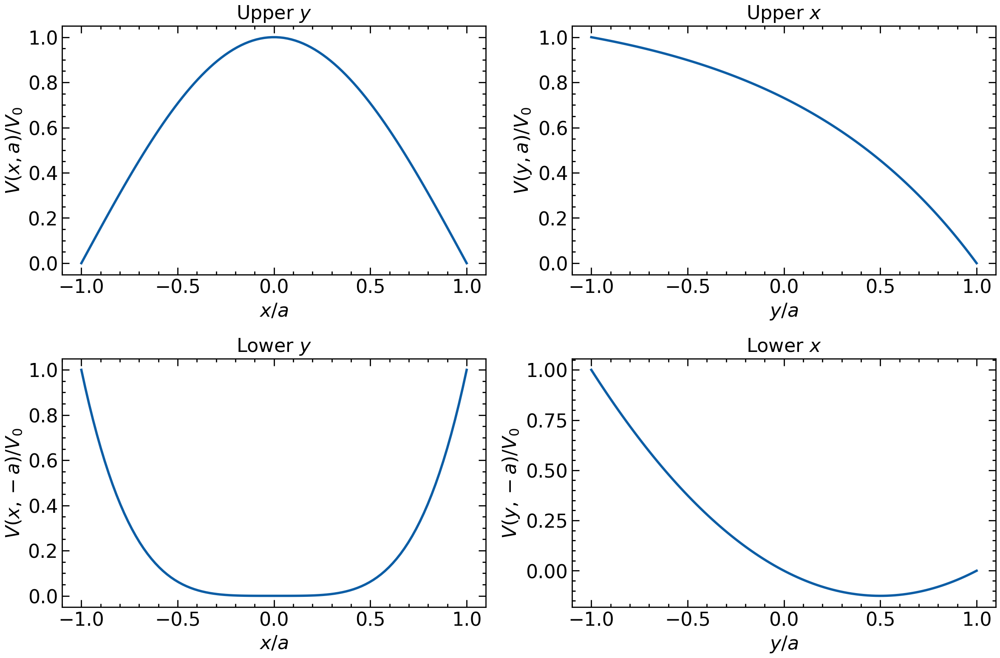
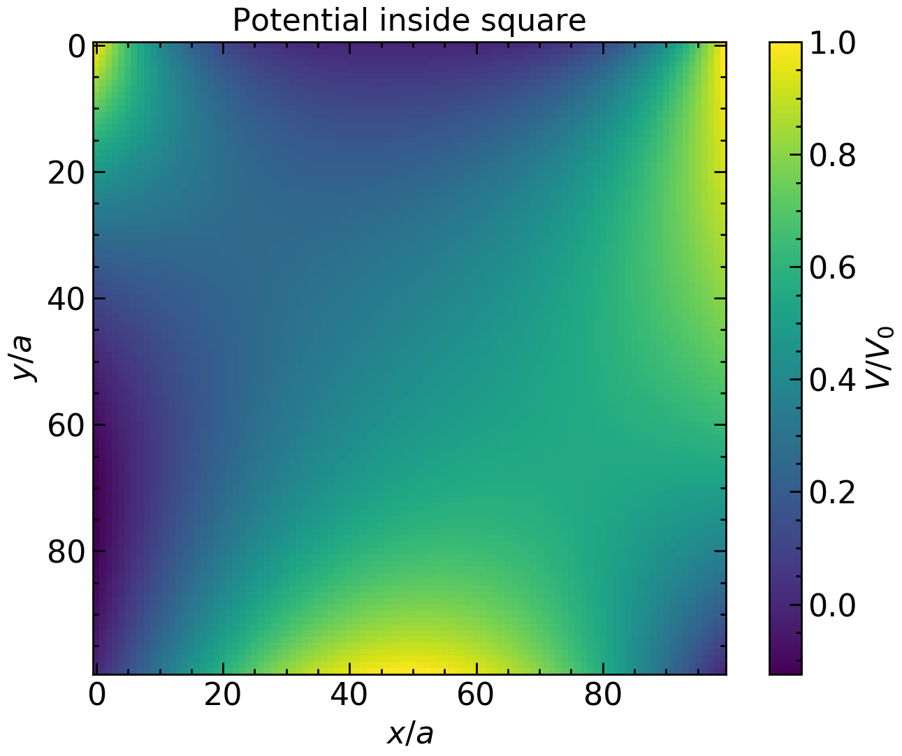

> Consider the boundary conditions of the following 2D potential $$V(x,y)$$ in the square $$x \in [-a, a]$$ and $$y \in [-a, a]$$
> 
> * $$V(x, a) = V_0 \cos \left(\frac{\pi}{2}\frac{x}{a} \right)$$
> * $$V(x, -a) = V_0 \left(\frac{x}{a}\right)^4$$
> * $$V(a, y) = V_0 \frac{1}{e^{-1}-e}(e^{y/a}-e)$$
> * $$V(-a, y) = V_0 \frac{1}{2}((y/a)^2+(y/a))$$
> 

# Preliminary

First we import the packages we will be using

~~~
import numpy as np
import matplotlib.pyplot as plt
from matplotlib import animation
from mpl_toolkits.mplot3d import Axes3D
from matplotlib.animation import PillowWriter
from matplotlib import cm
~~~
{: .language-python}

We will be using `numba` later on; we will import it when needed.

# Part 1

> Use the implicit central method to find the potential $$V(x,y)$$ in the square and make a surface plot

There are four edges to the square in question. First we will create 1D arrays that corresponds to the potential at each of the edges. The functional form for each of the 4 arrays is given above. We will use a density of 100 points total.

~~~
edge = np.linspace(-1, 1, 100)
upper_y = np.cos(np.pi * edge / 2)
lower_y = edge**4
upper_x = 1/(np.e**-1 - np.e) * (np.exp(edge)-np.e)
lower_x = 0.5 * (edge**2-edge)
~~~
{: .language-python}

Note that `edge` corresponds to $$x/a$$ for `upper_y` and `lower_y`, and corresponds to $$y/a$$ for `upper_x` and `lower_x`. Lets plot the potential at each edge of the square. Here I create a figure that consists of a $$2 \times 2$$ grid of axes. We plot each array on a different axis.

~~~
fig, ax = plt.subplots(2, 2, figsize=(12,8))

ax[0,0].set_xlabel('$x/a$')
ax[0,0].set_ylabel('$V(x,a)/V_0$')
ax[0,0].set_title('Upper $y$')
ax[0,0].plot(edge, upper_y)

ax[1,0].set_xlabel('$x/a$')
ax[1,0].set_ylabel('$V(x,-a)/V_0$')
ax[1,0].set_title('Lower $y$')
ax[1,0].plot(edge, lower_y)

ax[0,1].set_xlabel('$y/a$')
ax[0,1].set_ylabel('$V(y,a)/V_0$')
ax[0,1].set_title('Upper $x$')
ax[0,1].plot(edge, upper_x)

ax[1,1].set_xlabel('$y/a$')
ax[1,1].set_ylabel('$V(y,-a)/V_0$')
ax[1,1].set_title('Lower $x$')
ax[1,1].plot(edge, lower_x)

fig.tight_layout()
~~~
{: .language-python}

{:width="50%"}

We eventually need to solve for the potential **everywhere** in the square. To do this let's first create a $$100 \times 100$$ 2D array that will store all the values of the potential. We also create a meshgrid that corresponds to the $$(x,y)$$ coordinates of the potential.

~~~
xv, yv = np.meshgrid(edge, edge)
potential = np.zeros((100,100))
~~~
{: .language-python}

Notice that all the values are initialized to zero. Now we set each of the edges of the square equal to the corresponding boundary conditions. Here we make clever use of **slicing** on numpy arrays. Note that `potential[0,:]` corresponds to the zeroth row whereas `potential[:,0]` corresponds to the zeroth column. The index `-1` corresponds to the last row/column.

~~~
potential[0,:]= lower_y
potential[-1,:]= upper_y
potential[:,0]= lower_x
potential[:,-1]= upper_x
~~~
{: .language-python}

Now we will use an iterative method to generate $$V(x,y)$$ for all points in the 2D array. If we repeatedly use

$$V(x_i, y_j) \to \frac{1}{4}(V(x_{i+1}, y_{j}) + V(x_{i-1}, y_{j}) + V(x_{i}, y_{j+1}) + V(x_{i}, y_{j-1})) $$

for many iterations, it is guarenteed $$V(x,y)$$ will eventually converge to the **unique** solution of $$\nabla^2 V=0$$.

> ## Where is the recursive equation obtained from?
> Note that we require $$\nabla^2 V=0$$ everywhere in the square. We are in 2D, so this means $$\frac{\partial^2 V}{\partial x^2}+\frac{\partial^2 V}{\partial y^2}=0$$. This equation can be discretely approximated as
>
> $$\frac{V(x_{i+1}, y_j) - 2V(x_i, y_j) + V(x_{i-1}, y_j)}{(\Delta x)^2} + \frac{V(x_i, y_{j+1}) - 2V(x_i, y_j) + V(x_i, y_{j-1})}{(\Delta y)^2} = 0 $$
>
> Noting that $$ \Delta x = \Delta y$$ in our array, we can solve for $$V(x_i, y_j)$$ yielding
>
> $$V(x_i, y_j) = \frac{1}{4}(V(x_{i+1}, y_{j}) + V(x_{i-1}, y_{j}) + V(x_{i}, y_{j+1}) + V(x_{i}, y_{j-1}))$$
>
> So the idea is that if repeatedly set
>
> $$V(x_i, y_j) \to \frac{1}{4}(V(x_{i+1}, y_{j}) + V(x_{i-1}, y_{j}) + V(x_{i}, y_{j+1}) + V(x_{i}, y_{j-1}))$$
>
> without changing the boundaries, then we will eventually converge to the true, **unique** solution.
{: .callout}

Okay, lets now implement this recursive algorithm. There are two ways to do this in python: the first way is awful and should be avoided at all costs; the second way is beautiful and should make you very happy. We will begin with the first way.

### Method 1

The first way uses a triple forloop. It can be implemented as follows:

~~~
n_iter = 10000
for n in range(n_iter):
    for i in range(1, len(edge)-1):
        for j in range(1, len(edge)-1):
            potential[i,j] = 1/4 * (potential[i+1, j] + potential[i-1, j] + potential[i, j+1] + potential[i, j-1])
~~~
{: .language-python}

In the code above, the first loop is the number of iterations of $$V(x_i, y_j) \to \frac{1}{4}(V(x_{i+1}, y_{j}) + V(x_{i-1}, y_{j}) + V(x_{i}, y_{j+1}) + V(x_{i}, y_{j-1}))$$, the second loop loops through all the $$x$$ values of the array, and the third loop loops through all the $$y$$ values of the array. You should notice that this code takes a considerable amount of time to run (approx 1 to 5 minutes). 

So why did I say this method was "awful"? In python it is undesirable to use forloops to iterate over numpy arrays when modifying them. This is why there are techniques like element-wise functions implemented for numpy arrays. (For example, if `a` is numpy arrays then `a**2` produces a numpy array where all the elements are squared- in any other programming language you would need to use a forloop to do this). 

There is no simple numpy function for implementing the implicit difference method. However, there is something we can do...

### Method 2

The second method uses a python package called [numba](http://numba.pydata.org/). numba takes python code that contains numpy arrays and forloops and converts it to optimized C code. The trade-off is that you need to be very careful when writing code. This problem can be solved using numba as follows:

First we create a special numba function.
~~~
import numba
from numba import jit

@numba.jit("f8[:,:](f8[:,:], i8)", nopython=True, nogil=True)
def compute_potential(potential, n_iter):
    length = len(potential[0])
    for n in range(n_iter):
        for i in range(1, length-1):
            for j in range(1, length-1):
                potential[i][j] = 1/4 * (potential[i+1][j] + potential[i-1][j] + potential[i][j+1] + potential[i][j-1])
    return potential
   
~~~
{: .language-python}

Now we solve for the potential:

~~~
potential = np.zeros((100,100))
potential[0,:]= lower_y
potential[-1,:]= upper_y
potential[:,0]= lower_x
potential[:,-1]= upper_x
potential = compute_potential(potential, n_iter=10000)
~~~
{: .language-python}

Note that this is **much** faster than the first method using forloops in python.

## Preliminary Plot

We can create a preliminary color plot to see the potential everywhere.

~~~
plt.imshow(potential)
plt.xlabel('$x/a$')
plt.ylabel('$y/a$')
cbar = plt.colorbar()
cbar.set_label('$V/V_0$')
plt.title('Potential inside square')
~~~
{: .language-python}

{:width="50%"}

# Part 2

Now we will create an animated gif of a 3D plot that shows the potential in the region $$x \in [-a, a]$$ and $$y \in [-a, a]$$. Our gif will be of a surface plot the rotates in the $$\phi$$ direction as time progresses. Creating animations in python using matplotlib is not a difficult task. First we define two functions: `init` and `anim`.

~~~
def init():
    # Plot the surface.
    ax.plot_surface(xv, yv, potential, cmap=cm.coolwarm,
                       linewidth=0, antialiased=False)
    ax.set_xlabel('$x/a$')
    ax.set_ylabel('$y/a$')
    ax.set_zlabel('$V/V_0$')
    return fig,

def animate(i):
    ax.view_init(elev=10, azim=2*i)
    return fig,
~~~
{: .language-python}

* The function `init` sets up our figure and axis with everything we want to be present in the animation in the first frame. Why does such an animation exist? Well if our gif is of a rotating surface, we don't want to have to redraw it in matplotlib every single frame, so it is easier to do this once in an `init` function.

* The function `animate` takes a argument `i` which is the current frame of the animation. The "art" involved in making animations is relates the frame `i` to the changing portion of the animation. For example, if one is plotting an animation of $$\cos(kx-\omega t)$$ where the function should move on the axis, one might set $$t=i$$ so the function shifts a little bit each frame (if it shifts too much, maybe $$t=\frac{1}{100}i$$). The code in the animate function would then be `ax.plot(np.cos(k*x-omega*i))`. In our case we need to rotate our 3d plot. I have found that setting the azimuthal angle `azim` equal to `2*i` (i.e. two times the current frame) makes it so the rotation is not too fast. You can play around with this.

Now we need to feed in these two functions into a special matplotlib function which creates and saves the animation. I will also create an axes and the figure.

~~~
fig = plt.figure()
ax = Axes3D(fig)
ani = animation.FuncAnimation(fig, animate, init_func=init,
                               frames=180, interval=50)
ani.save('rotate_azimuth_angle_3d_surf.gif',writer='imagemagick',fps=20)
~~~
{: .language-python}

Lets examine all the parameters passed to the animate function

* `fig`: The created figure which will be used in the animation function
* `animate`: The animate function which we previously created
* `init`: The initial function which we previously created
* `frames`: The number of frames to use in the animation (180 frames where `azim=2*i` means the gif will contain a full 360 degrees rotation)
* `inteveral`: The time between frames in milliseconds. Note that **this does not define the frame rate**: it is slightly more complicated but I find 50 is a good value.

It's not until we save the animation that we actually specify the frame rate. You'll see this above in the `ani.save`. All you need to worry about in that line is that we named the gif, and we specified the frame rate at 20 frames per second. You have now created a gif using python!

{:width="50%"}

