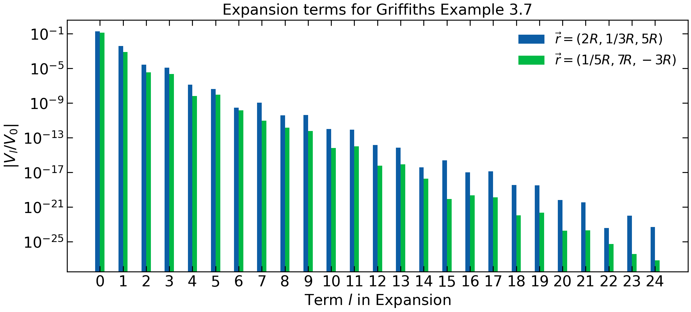

# Preliminary

Lets import all the packages we will use today. Note that we are importing the hermite and legendre polynomials.

~~~
import numpy as np
import matplotlib.pyplot as plt
from scipy.integrate import quad
from scipy.special import legendre
from scipy.special import hermite
from scipy.special import factorial
~~~
{: .language-python}

# Part 1: Special Functions in Python

Throughout your studies in physics, many special functions will be encountered. These include things like the legendre, laguerre, and hermite polynomials. While it is possible to look these up in a table and copy them into python, scipy has these polynomials already cooked up. In this tutorial we will look at the hermite polynomials.

> Recall from PHYS 215 that wavefunction for the harmonic oscillator can be written as 
>
> $$\psi_n(x) = \left(\frac{m\omega}{\pi \hbar}\right)^{1/4}\frac{1}{\sqrt{2^nn!}}H_n(\xi)e^{-\xi^2/2} $$
>
> where $$\xi=\sqrt{m\omega/\hbar} x$$ and $$H_n$$ are the Hermite polynomials. Plot $$\psi_0$$, $$\psi_1$$, $$\psi_2$$, $$\psi_4$$, and $$\psi_8$$ as a function of $$\xi$$.

Now we will use the `hermite` function that we imported at the beginning. This function takes in a parameter $n$ and returns a `poly1d` object.

~~~
hermite_2 = hermite(2)
~~~
{: .language-python}

We can then evaluate the polynomial for arbitrary $$\xi$$

~~~
hermite_2(10)
~~~
{: .language-python}

Alternative, we can do this more quickly as follows:

~~~
hermite(2)(10)
~~~
{: .language-python}

where "2" defines $$n$$ and "10" specifies the value of $$\xi$$ in $$H_n(\xi)$$. Now lets plot the wave functions. First we define a function that gives us the wave functions (as a function of $$\xi$$ and $$n$$). Note that to make everything dimensionless, the function really represents $$\left(\frac{\pi \hbar}{m\omega}\right)^{1/4} \psi_n(x)$$.

~~~
def psi(xi, n):
    return (1/np.sqrt(2**n * factorial(n))) * hermite(n)(xi) * np.exp(-xi**2 /2)

xi = np.linspace(-10, 10, 100)
psi0 = psi(xi, 0)
psi1 = psi(xi, 1)
psi2 = psi(xi, 2)
~~~
{: .language-python}

Now plot

~~~
plt.plot(xi, psi0, label='$n=0$')
plt.plot(xi, psi1, label='$n=1$')
plt.plot(xi, psi2, label='$n=2$')
plt.xlabel(r'$\sqrt{m\omega/\hbar} x$')
plt.ylabel(r'$\left(\frac{\pi \hbar}{m\omega}\right)^{1/4} \psi_n(x)$')
plt.title('Wave Functions of the Harmonic Oscillator')
plt.legend()
~~~
{: .language-python}

{:width="65%"}

# Part 2: Bar Plots in Python

For this part of the tutorial, we will consider example 3.7 in Griffiths E&M: 

$$V(r, \theta) = \sum_{l=0}^{\infty} \frac{2l+1}{2} \left(\frac{R}{r}\right)^{l+1}  \left( \int_{0}^{\pi} V_0(\theta) P_l(\cos\theta) \sin \theta d\theta \right) P_l(\cos \theta) $$

we can define the lth term in this sum as 

$$V_l(r, \theta) = \frac{2l+1}{2} \left(\frac{R}{r}\right)^{l+1}  \left( \int_{0}^{\pi} V_0(\theta) P_l(\cos\theta) \sin \theta d\theta \right) P_l(\cos \theta) $$

> Consider the potential $$V_0(\theta) = V_0 e^{-(\theta-\pi/2)^2 / \pi^2}$$ and the point $$\vec{r}=(2R,R/3,0)$$. Make a bar plot of $$V_l$$ vs. $$l$$ for $$l$$ in the range 1 to 33 to show how quickly the terms decay.

Firstly note that we will need to plot

$$ \frac{V_l}{V_0} = \frac{2l+1}{2} \left(\frac{R}{r}\right)^{l+1}  \left( \int_{0}^{\pi} e^{-(\theta-\pi/2)^2 / \pi^2} P_l(\cos\theta) \sin \theta d\theta \right) P_l(\cos \theta) $$

Let's $$V_l$$ and get arrays of $$l$$'s and $$V_l$$'s in the range 1 to 33.

~~~
def integrand(theta_p, l):
    return np.exp(-(theta_p - np.pi/2)/np.pi**2)*legendre(l)(np.cos(theta_p)) * np.sin(theta_p)

def Vl(x_R, y_R, z_R, l):
    r_R = np.sqrt(x_R**2+y_R**2+z_R**2)
    theta = np.arctan(np.sqrt(x_R**2+y_R**2)/z_R)
    integral = quad(integrand, 0, np.pi, args=(l))[0]
    return (2*l+1)/2 * (1/r_R)**(l+1) * integral * legendre(l)(np.cos(theta))
~~~
{: .language-python}

Now get data

~~~
x_R0, y_R0, z_R0 = 2, 1/3, 5
ls = np.arange(0, 25, 1)
Vls = np.vectorize(Vl)(x_R0, y_R0, z_R0, ls)
~~~
{: .language-python}

Now we can make a simple bar plot.

~~~
plt.figure(figsize=(12,5))
plt.bar(ls, Vls)
plt.semilogy()
plt.xlabel('$l$')
plt.ylabel(r'$V_l/V_0$')
plt.minorticks_off()
plt.xticks(ls)
plt.title('Decaying Terms in Griffiths Example 3.7')
plt.show()
~~~
{: .language-python}

{:width="65%"}

To get the true potential at the point we're considering $$\vec{r} = (2R,R/3,5R)$$ we would need to add up all the contributions above. However, since they decrease so quickly (see logarithmic y axis) we usually only need to consider the first few terms for reasonable precision in real life scenarios.

> Now consider two points $$\vec{r}_1 = (2R,R/3,5R)$$ and $$\vec{r}_2 = (R/5,7R,-3R)$$. Plot $$V_l$$ vs. $$l$$ with the bars next to eachother.

This is a little finicky in python. First lets define out arrays

~~~
x_R0, y_R0, z_R0 = 2, 1/3, 5
Vls_point1 = np.vectorize(Vl)(x_R0, y_R0, z_R0, ls)
x_R0, y_R0, z_R0 = 1/5, 7, -3
Vls_point2 = np.vectorize(Vl)(x_R0, y_R0, z_R0, ls)
~~~
{: .language-python}

In order to plot the bars next to eachother, we need to shift the n's slightly. We also specify `barWidth`: 0.4 works nicely for this plot but you may need to adjust this value for plots you make. You should try changing `barWidth` and see how it affects this plot.

~~~
barWidth = 0.4
ls1 = ls-barWidth/2
ls2 = ls+barWidth/2

plt.figure(figsize=(12,5))
plt.title('Expansion terms for Griffiths Example 3.7')
plt.bar(ls1, Vls_point1, width=barWidth, label=r'$\vec{r}=(2R,1/3R,5R)$')
plt.bar(ls2, Vls_point2, width=barWidth, label=r'$\vec{r}=(1/5R,7R,-3R)$')
plt.xlabel('Term $l$ in Expansion')
plt.ylabel(r'$V_l/V_0$')
plt.semilogy()
plt.minorticks_off()
plt.xticks(ls)
plt.legend(loc='upper right', fontsize=14)
plt.show()
~~~
{: .language-python}

{:width="65%"}

Note that the terms decay **very** quickly, but differently depending on the point you are situated at.
