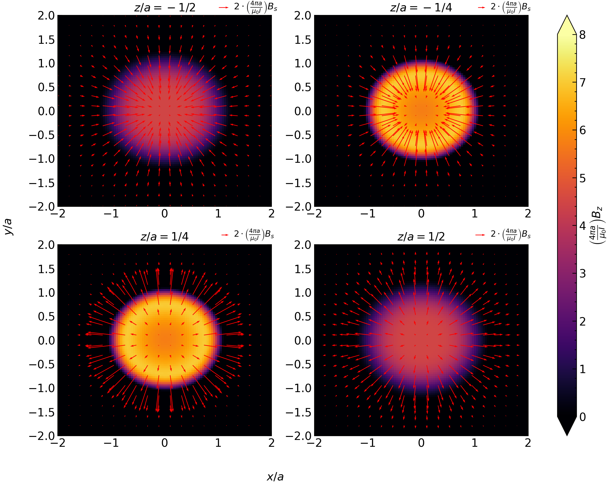
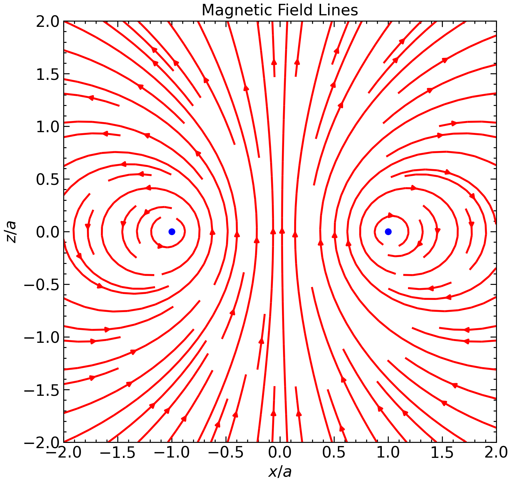

# Preliminary

Lets import all the packages we will use today.

~~~
import numpy as np
import matplotlib.pyplot as plt
from matplotlib import cm
cmap = cm.inferno
import scipy as sp
from scipy.integrate import quad
~~~
{: .language-python}

> Consider a current loop of radius $$a$$ centered at the origin in the $$z=0$$ plane with current travelling in a counter-clockwise direction in the $$xy$$ plane. 

# Part 1
> Plot $$B_x$$ and $$B_y$$ on the planes $$z=-a/2$$, $$z=-a/4$$, $$z=a/4$$ and $$z=a/2$$. Use a quiver plot. On the same axes, plot a heat plot of $$B_z$$. Based on the plot, are the results consistent with Griffiths Figure 5.55 for a "Physical" dipole?

Like in previous tutorials, we first define the integrands for each of the magnetic field components and then the components themselves.

~~~
def integrandx(t, x_a, y_a, z_a):
    return z_a * np.cos(t) / ((x_a-np.cos(t))**2+(y_a-np.sin(t))**2+(z_a)**2)**(3/2)
def integrandy(t, x_a, y_a, z_a):
    return z_a * np.sin(t) / ((x_a-np.cos(t))**2+(y_a-np.sin(t))**2+(z_a)**2)**(3/2)
def integrandz(t, x_a, y_a, z_a):
    return (-np.sin(t)*(y_a-np.sin(t)) - np.cos(t)*(x_a-np.cos(t))) / ((x_a-np.cos(t))**2+(y_a-np.sin(t))**2+(z_a)**2)**(3/2)

def Bx(x_a, y_a, z_a):
    return quad(integrandx, 0, 2*np.pi, args=(x_a, y_a, z_a))[0] 
def By(x_a, y_a, z_a):
    return quad(integrandy, 0, 2*np.pi, args=(x_a, y_a, z_a))[0] 
def Bz(x_a, y_a, z_a):
    return quad(integrandz, 0, 2*np.pi, args=(x_a, y_a, z_a))[0] 
~~~
{: .language-python}

Now we create a meshgrid which we will use to plot $$B_z$$ as a heat plot. We choose 100 points in $$ x \in [-2a, 2a]$$ and $$y \in [-2a, 2a]$$.
~~~
x = np.linspace(-2, 2, 100)
y = np.linspace(-2, 2, 100)
xh, yh = np.meshgrid(x, y)
~~~
{: .language-python}

Now we create a meshgrid which we will use to plot $$B_x$$ and $$B_y$$ as a quiver plot. We choose 20 points in $$ x \in [-2a, 2a]$$ and $$y \in [-2a, 2a]$$. Note that we have chosen less points than in the heat map meshgrid: this is because the quiver plot requires significantly less points than the heat plot, as we will see below.

~~~
x = np.linspace(-2, 2, 100)
y = np.linspace(-2, 2, 100)
xq, yq = np.meshgrid(x, y)
~~~
{: .language-python}

Using the meshgrids, we now obtain the magnetic fields at the four planes $$z = a/2$$, $$z=a/4$$, $$z=-a/4$$, and $$z=-a/2$$.

~~~
# For heat plot
mag_field_z1 = np.vectorize(Bz)(xh, yh, -0.5)
mag_field_z2 = np.vectorize(Bz)(xh, yh, -0.25)
mag_field_z3 = np.vectorize(Bz)(xh, yh, 0.25)
mag_field_z4 = np.vectorize(Bz)(xh, yh, 0.5)
# For quiver plot
mag_field_x1 = np.vectorize(Bx)(xq, yq, -0.5)
mag_field_y1 = np.vectorize(By)(xq, yq, -0.5)
mag_field_x2 = np.vectorize(Bx)(xq, yq, -0.25)
mag_field_y2 = np.vectorize(By)(xq, yq, -0.25)
mag_field_x3 = np.vectorize(Bx)(xq, yq, 0.25)
mag_field_y3 = np.vectorize(By)(xq, yq, 0.25)
mag_field_x4 = np.vectorize(Bx)(xq, yq, 0.5)
mag_field_y4 = np.vectorize(By)(xq, yq, 0.5)
~~~
{: .language-python}

We now make a 2x2 figure which we will use to plot the magnetic field in each of the 4 planes. It is plotted below:

~~~
fig, axes = plt.subplots(2, 2, figsize=(15,11))

# Upper Left
ax = axes[0,0]
cs = ax.pcolor(xh, yh, mag_field_z1, cmap=cmap, vmin=0, vmax=8)
Q = ax.quiver(xq, yq, mag_field_x1, mag_field_y1, units='width', color='r')
ax.set_title('$z/a = -1/2$')
qk = ax.quiverkey(Q, 0.8, 1.04, 2, r'$2 \cdot \left( \frac{4 \pi a}{\mu_0 I} \right)B_s$', labelpos='E',
                   coordinates='axes', fontproperties={'size':13})

# Upper Right
ax = axes[0,1]
cs = ax.pcolor(xh, yh, mag_field_z2, cmap=cmap, vmin=0, vmax=8)
Q = ax.quiver(xq, yq, mag_field_x2, mag_field_y2, units='width', color='r')
ax.set_title('$z/a = -1/4$')
qk = ax.quiverkey(Q, 0.8, 1.04, 2, r'$2 \cdot \left( \frac{4 \pi a}{\mu_0 I} \right)B_s$', labelpos='E',
                   coordinates='axes', fontproperties={'size':12})

# Lower Left
ax = axes[1,0]
cs = ax.pcolor(xh, yh, mag_field_z3, cmap=cmap, vmin=0, vmax=8)
Q = ax.quiver(xq, yq, mag_field_x3, mag_field_y3, units='width', color='r')
ax.set_title('$z/a = 1/4$')
qk = ax.quiverkey(Q, 0.8, 1.05, 2, r'$2 \cdot \left( \frac{4 \pi a}{\mu_0 I} \right)B_s$', labelpos='E',
                   coordinates='axes', fontproperties={'size':12})

# Lower Right
ax = axes[1,1]
cs = ax.pcolor(xh, yh, mag_field_z4, cmap=cmap, vmin=0, vmax=8)
Q = ax.quiver(xq, yq, mag_field_x4, mag_field_y4, units='width', color='r')
ax.set_title('$z/a = 1/2$')
qk = ax.quiverkey(Q, 0.8, 1.05, 2, r'$2 \cdot \left( \frac{4 \pi a}{\mu_0 I} \right)B_s$', labelpos='E',
                   coordinates='axes', fontproperties={'size':12})

cbar = fig.colorbar(cs, ax=axes, extend='both', label=r'$\left( \frac{4 \pi a}{\mu_0 I} \right)B_z$')
fig.text(0.4, 0.045, '$x/a$', fontsize=16)
fig.text(0.06, 0.5, '$y/a$', ha='center', va='center', rotation='vertical', fontsize=16)
#fig.tight_layout()
plt.savefig('mag_field.png', dpi=200)
plt.show()
~~~
{: .language-python}

{:width="65%"}

To examine what's going on here, lets look only at the upper left plot. 

* Firstly we make a heat plot in the line `cs = ax.pcolor(xh, yh, mag_field_z1, cmap=cmap, vmin=0, vmax=8)`. This makes a color plot of the z-component of the magnetic field. The `vmin` and `vmax` arguments were carefully chosen so that the numerical values of the magnetic field mapped to reasonable colors in the color plot. 
* Next we make a quiver plot in the line `Q = ax.quiver(xq, yq, mag_field_x1, mag_field_y1, units='width', color='r')`. A quiver plot takes a coordinate $$(x,y)$$ and plots an arrow proportional to $$(B_x(x,y), B_y(x,y))$$ at that coordinate; in otherwords, it plots a vector field. 
* The line `qk = ax.quiverkey(Q, 0.8, 1.05, 2, r'$2 \cdot \left( \frac{4 \pi a}{\mu_0 I} \right)B_s$', labelpos='E', coordinates='axes', fontproperties={'size':12})` provides a legend relating the length of the arrows to the magnititude $$\sqrt{B_x^2 + B_y^2}$$ of each vector. The frst two numbers 0. and 1.05 give the location of where to put the legend. The next argument "2" enforces that the length of the arrow in the legend be equal to what the length of an arrow with numerical value of 2 would give on the quiver plot. 

This is one way to view a three dimensional vector field (quiver plot for two of the dimensions ($$x$$ and $$y$$) and heat plot for the third dimension $$z$$) but in part 2 we exploit the azimuthal symmetry of this problem and create a simplified plot...

# Part 2
> Make a streamplot of $$B_x$$ and $$B_z$$ in the plane $$y=0$$ for $$x \in [-2a, 2a]$$ and $$z \in [-2a, 2a]$$.

The streamplot here is easy to make. Like before, we first generate a meshgrid of 40 points in $$x \in [-2a, 2a]$$ and $$z \in [-2a, 2a]$$ at $$y=0$$. 

~~~
x = np.linspace(-2, 2, 40)
z = np.linspace(-2, 2, 40)
xd, zd = np.meshgrid(x, z)
mag_field_x = np.vectorize(Bx)(xd, 0, zd)
mag_field_z = np.vectorize(Bz)(xd, 0, zd)
~~~
{: .language-python}

Now that we have the data we can make the stream plot. The code is as follows:

~~~
fig, ax = plt.subplots(1, 1, figsize=(8,8))

ax.streamplot(xd, zd, mag_field_x, mag_field_z, color='r')
ax.scatter([-1], [0], color='blue', zorder=100)
ax.scatter([1], [0], color='blue', zorder=100)
ax.set_xlabel('$x/a$')
ax.set_ylabel('$z/a$')
ax.set_title('Magnetic Field Lines')
plt.show()
~~~
{: .language-python}

{:width="65%"}

Note that we also add two additional blue dots that are located at the position where the ring intersects the plane $$y=0$$.
