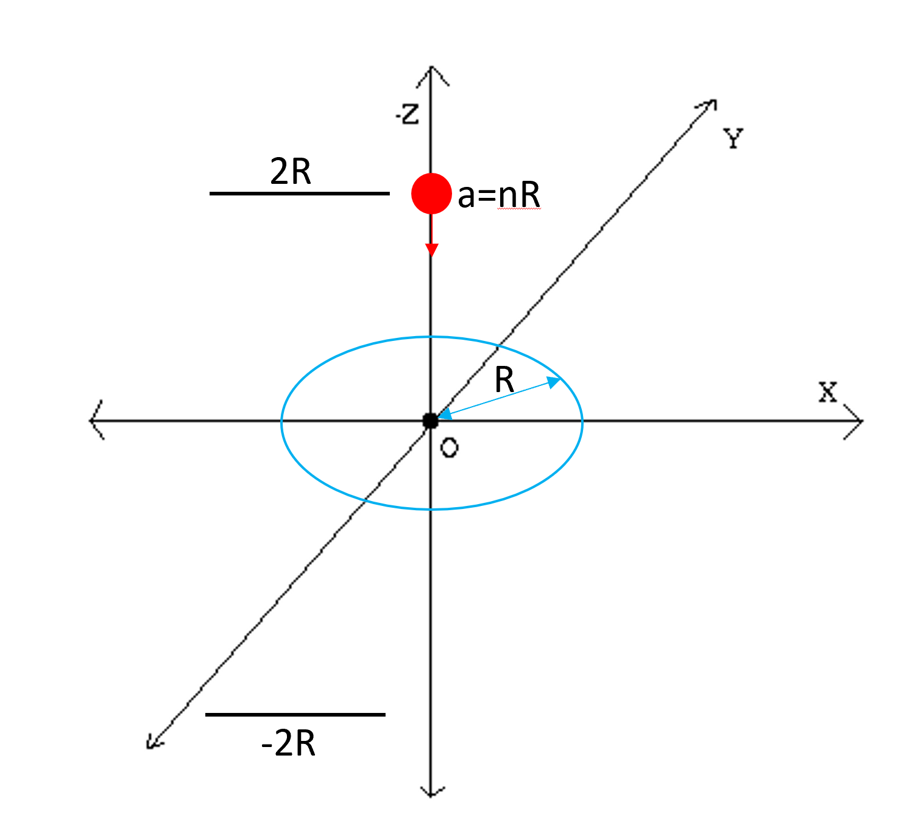
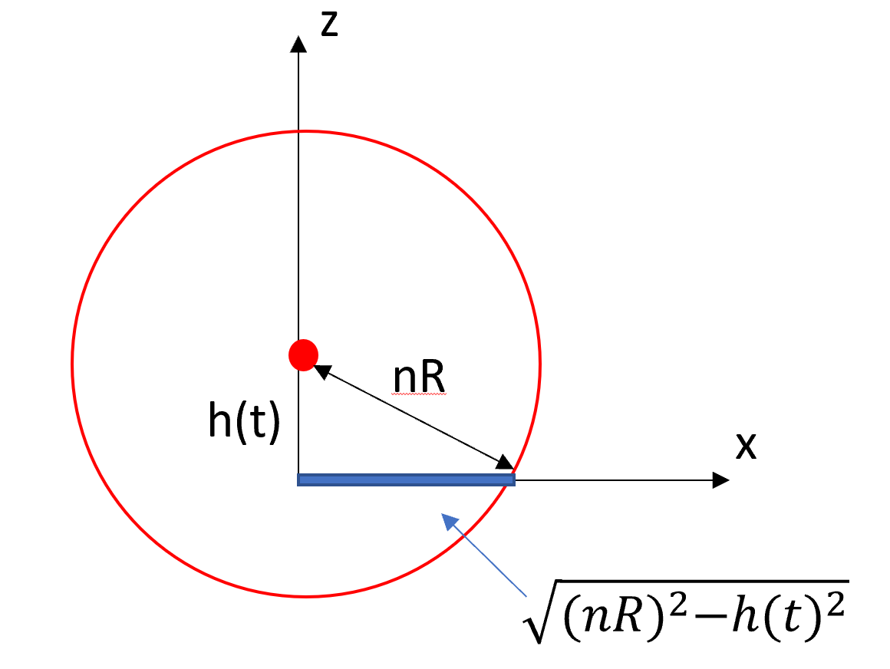

> Consider a loop of wire with radius $$R$$ located in the plane $$z=0$$ and centered at the origin. Consider also a sphere of constant magnetization $$\vec{M} = -M \hat{z}$$ with radius $$a$$ like the one considered in Griffith's Example 6.1. The sphere moves at constant velocity $$-v\hat{z}$$ and its center moves from $$(0, 0, 2R)$$ to $$(0, 0, -2R)$$. For this problem, it will be useful to write $$a = nR$$ where $$n$$ is some constant (less than 1 so the sphere can fit through the wire loop). The end goal of this problem is to plot the induced EMF in the wire loop as a function of time. To do this, however, we need to be very careful with our dimensionless variables.

{:width="50%"}

Before doing anything, I recommend making a careful drawing of the problem, highlighting the current loop, the magnetized object, and the direction in which it moves. It is worth noting that

$$\varepsilon = -\frac{d\Phi}{dt} = -\frac{d}{dt} \oint \vec{B} \cdot d\vec{A} = -\frac{d}{dt}\oint B_z dA $$

so the order of buisness will be finding the $$z$$ component of the magnetic field due to the magnetized sphere.

# Part 1
> Find $$B_z(t)$$ at $$z=0$$. Use this to determine $$\Phi(t)$$ through the ring.

From Griffith's Example 6.1, we know the the magnetic field of a magnetizied sphere at the origin is given be

$$\vec{B} = \begin{cases} \frac{\mu_0}{4\pi} \frac{1}{r^3} \left(3(\vec{m} \cdot \hat{r})\hat{r} - \vec{m} \right) & \text{outside sphere}\\
                          \frac{2}{3} \mu_0 \vec{M} & \text{inside sphere}\end{cases}$$
                          
where $$\vec{m} = \frac{4}{3} \pi a^3 \vec{M}$$. For this problem, we will write everything in terms of $$m$$: the effective total dipole moment of the sphere.

Note that in this problem the sphere is not always at the origin and thus we need to replace $$\vec{r} \to \vec{r}-\vec{r}'$$ where $$\vec{r}'$$ is the center of the sphere. Since solving for $$\Phi = \oiint \vec{B} \cdot d\vec{a}$$ requires integrating over a circle at $$z=0$$ we have $$\vec{r} = (r\cos\phi, r\sin\phi, 0)$$. The center of the sphere is $$\vec{r}' = (0, 0, h(t))$$ where $$h(t)$$ is the current height of the center of the sphere above the current loop. 

So what is $$h(t)$$? Since the dipole moves at constant velocity $$-v\hat{z}$$ and starts at $$z=2R$$ it should be obvious that $$h(t) = 2R-vt$$. We can rewrite this in a dimensionless ratio as $$h/R = 2 - (v/R)t = 2-T$$ where $$T \equiv (v/R)t$$. This is a dimensionless variable representing time. Then

$$B_z^{\text{outside sphere}} = \frac{\mu_0 m }{4 \pi}\left(\frac{-3h(t)^2}{(r^2+h(t)^2)^{5/2}} + \frac{1}{(r^2+h(t)^2)^{3/2}} \right)$$

in terms of dimensionless quantities is 

$$\frac{4 \pi R^3}{\mu_0 m } B_z^{\text{outside sphere}} = \left(\frac{-3(h/R)^2}{((r/R)^2+(h/R)^2)^{5/2}} + \frac{1}{((r/R)^2+(h/R)^2)^{3/2}} \right) $$

meanwhile, with $$a = nR$$ we get 

$$\frac{4 \pi R^3}{\mu_0 m } B_z^{\text{inside sphere}} = \frac{-2}{n^3}$$

Now we need to determine the times when the sphere intesects the plane $$z=0$$. We know the sphere intersects the plane $$z=0$$ when $$-a \leq h \leq a$$ or $$-nR \leq h \leq nR$$. Since $$h = 2R - RT$$ we get $$-nR \leq 2R - RT \leq nR$$ or equivalently $$-n \leq T-2 \leq n$$. How much area of the plane does the sphere intesect at a given time $$T$$? A simple diagram shows that the circle of intersection has a radius $$r_{int} = \sqrt{n^2R^2 - h^2}$$.

{:width="50%"}

## Flux When Sphere Intersects z=0

For these special times we thus have

$$\Phi = \oint_{r<r_{int}} B_{z}^{\text{inside sphere}} r dr d\phi +  \oint_{r>r_{int}} B_{z}^{\text{outside sphere}} r dr d\phi$$

Substituting everything in, trivially integrating over $$\phi$$, and writing in terms of dimensionless quantities we have

$$ \frac{4 \pi R}{\mu_0 m} \Phi = \pi\left(n^2-\left(\frac{h}{R}\right)^2 \right)\left(\frac{-2}{n^3}\right) + 2 \pi \int_{\sqrt{n^2-(h/R)^2}}^{1} \left(\frac{-3(h/R)^2}{((r/R)^2+(h/R)^2)^{5/2}} + \frac{1}{((r/R)^2+(h/R)^2)^{3/2}} \right) \frac{r}{R} d\left(\frac{r}{R}\right) $$

## Flux When Sphere Does Not Intersect z=0

Otherwise we get the simpler case of

$$ \frac{4 \pi R}{\mu_0 m} \Phi = 2 \pi \int_{0}^{1} \left(\frac{-3(h/R)^2}{((r/R)^2+(h/R)^2)^{5/2}} + \frac{1}{((r/R)^2+(h/R)^2)^{3/2}} \right) \frac{r}{R} d\left(\frac{r}{R}\right) $$

# Part 2
> Write a function to determine $$\Phi(t)$; recall the piecewise form of the function above. Find the magnetic flux at 1000 time points from when the magnetic sphere goes from $$(0, 0, 2R)$$ to $$(0, 0, -2R)$$ for a few differnt values on $$n$$. Take the negative derivative to determine the EMF induced in the coil. Plot both the magnetic flux and the EMF as a function of time. Compare these plots to Figure 7.23 in Griffith's. Do the plots look different? Why?

First we import the packages we need

~~~
import numpy as np
import matplotlib.pyplot as plt
from scipy.integrate import quad
~~~
{: .language-python}

Now we define $$h/R$$, the integrand specified in the two integrals above, and the flux $$\frac{4 \pi R}{\mu_0 m} \Phi$$ as a function of $$T$$ (and $$n$$):

~~~
def h_R(T):
    return 2-T

def integrand(r_R, n, T):
    return (-3*h_R(T)**2 / (r_R**2+h_R(T)**2)**(5/2) + 1/(r_R**2+h_R(T)**2)**(3/2) ) * r_R

def flux(n, T):
    if np.abs(h_R(T)) < n:
        return np.pi * (n**2-h_R(T)**2) * (-2/n**3) \
                + 2*np.pi*quad(integrand, np.sqrt(n**2-h_R(T)**2), 1, args=(n, T))[0]
    else:
        return 2*np.pi*quad(integrand, 0, 1, args=(n, T))[0]
~~~
{: .language-python}

From this we can obtain arrays of the flux vs. $$T$$ from $$T:0 \to 4n$$ (i.e. center of sphere goes from $$z=-2R$$ to $$z=2R$$) for a few different values of $$n$$:

~~~
T = np.arange(0,4,0.01)
fluxs1 = np.vectorize(flux)(0.5, T)
fluxs2 =  np.vectorize(flux)(0.001, T)
~~~
{: .language-python}

Lets plot:

~~~
plt.plot(T, fluxs1)
plt.plot(T, fluxs2)
plt.xlabel(r'$\frac{v}{R}t$', fontsize=14)
plt.ylabel(r'$\frac{4 \pi R}{\mu_0 m} \Phi$', fontsize=14)
plt.grid()
~~~
{: .language-python}

Interestingly, the flux at any time does not depend on $$n$$.

Now we need to find the induced emf $$\varepsilon$$. Note that our array above is of $$\Phi(T)$$ so we can only directly take $$d\Phi/dT$$ and not $$d\Phi/dt$$ like we need to. Since

$$\varepsilon = -\frac{d\Phi}{dt} = -\frac{v}{R}\frac{d\Phi}{d(v/R \cdot t)} = -\frac{v}{R}\frac{d\Phi}{dT}$$

we get

$$ \frac{4 \pi R^2}{\mu_0 m v} \varepsilon = -\frac{d}{dT} \left(\frac{4 \pi R}{\mu_0 m} \Phi \right) $$

note that we have access to everything on the right. We can take the derivative with respect to $$T$$ because this is how our array is constructed. Everything inside the brackets on the RHS is the dimensionsless quantity we have stored in our array. We thus take the derivative...

~~~
EMF = -np.gradient(fluxs1)
~~~
{: .language-python}

and then plot using the correct labels

~~~
plt.plot(T, EMF)
plt.xlabel(r'$\frac{v}{R}t$', fontsize=14)
plt.ylabel(r'$\frac{4 \pi R^2}{\mu_0 m v}\varepsilon$', fontsize=14)
plt.title('Induced EMF in Circular Wire')
plt.grid()
~~~
{: .language-python}

Lets compare these to the plots in Griffiths. Firstly note that our flux plot does not flatten out like Griffiths; this is due to the fact that the griffiths example is with a cylindrical magnet and not a spherical one. This also explains the difference in the EMF plot which is simply the derivative of the flux plot.
